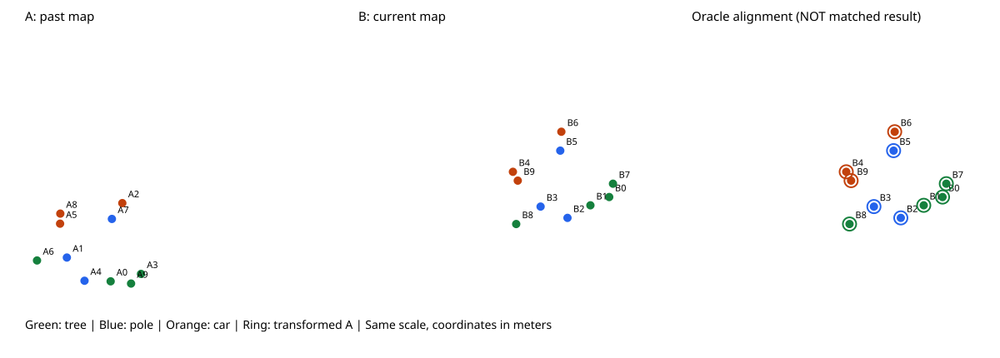

# 가상 object map 실험

Python 3 표준 라이브러리만 사용합니다. 패키지 설치가 필요 없습니다.

## 실행

이 폴더에서 터미널을 열어 실행합니다.

현재 PC에는 일반 Python이 등록되어 있지 않아, 검증에 사용한 제공 환경으로 실행하는 스크립트를 추가했습니다.

```powershell
.\run.ps1
```

Python을 별도로 설치한 환경에서는 다음 명령을 사용합니다.

```powershell
py -3 experiment.py
```

Mac/Linux에서는 `python3 experiment.py`를 사용하세요.
한 번씩만 확인하려면 `--trials 1`, 반복 횟수를 바꾸려면 `--trials 100`을 붙입니다.

## 결과 읽기

- `results/clean/maps.svg`: 잡음이 없는 지도. 브라우저로 엽니다.
- `results/extra_5/maps.svg`: 현재 지도에 객체 5개를 추가한 예시.
- `results/noise_020/maps.svg`: 각 좌표에 표준편차 0.2 m의 Gaussian 잡음을 준 예시.
- 각 조건의 `maps.json`: 첫 시행의 지도, 정답 대응, 후보와 지표.
- `results/metrics.csv`: 모든 조건·시행 결과. 기본 7조건 × 30회 = 210행.

그림 왼쪽은 과거 지도 A, 가운데는 현재 지도 B, 오른쪽은 정답 대응으로 정합한 결과입니다.
링은 변환된 A, 채워진 점은 B입니다. 지도마다 번호는 독립적이며 B의 순서를 섞었습니다.
30도 회전과 (10, 5)m 평행이동은 A 좌표를 B 좌표로 바꾸는 변환입니다.
2D는 학습용 선택이며 최종 연구 지도를 2D로 제한한다는 뜻은 아닙니다.

## 구현 범위

`make_maps`: 10개 객체의 지도를 만들고 알려진 변환·추가 객체·잡음 적용.
`candidates`: 같은 class의 모든 객체를 연결. 입력에 정답 ID가 없습니다.
`estimate_transform`: 알려진 대응에서 2D least-squares 회전·이동 계산.
`run`: 정답으로 후보 품질을 채점하고 oracle 변환 오차 계산.

현재는 **SlideGraph와 CLIPPER를 구현하지 않았습니다**.
정답 대응을 사용하는 oracle 결과는 계산 코드 점검용이며 실제 매칭 성공률이 아닙니다.
잡음은 좌표만 바꾸고 class는 바꾸지 않으므로 이 기준 방법의 후보 recall은 항상 100%입니다.
기본 후보는 tree 4×4 + pole 3×3 + car 3×3 = 34개이며 정답은 10개입니다.
추가 객체가 늘면 후보 수가 늘고 precision이 떨어집니다. 잡음만 늘면 후보 수는 유지됩니다.

처리 시간/실제 정합 성공률/CLIPPER 이후 지표는 아직 측정하지 않습니다.
후보 누락, 잘못된 class, 겹치지 않는 지도도 아직 실험에 포함하지 않습니다.
후속 단계에서 실제 SlideGraph 및 CLIPPER를 연결한 뒤 평가 범위를 넓힙니다.

## 추천 확인 순서

1. clean 그림을 열어 배치가 회전·이동했는지 확인합니다.
2. clean의 oracle 오차가 부동소수점 오차 수준인지 확인합니다.
3. extra_5에서 후보 수 증가와 precision 하락을 확인합니다.
4. noise_020에서 후보 recall은 유지되지만 oracle 오차가 발생하는지 확인합니다.

같은 seed는 재현 가능한 난수를 사용하며, 조건 간 같은 기본 지도를 사용합니다.
같은 출력 폴더로 재실행하면 해당 실험 결과 파일을 갱신합니다.

## 저장된 실험 결과 (2026-09-11)

[210회 결과 CSV](results/metrics.csv) · [기본 지도](results/clean/maps.svg) · [추가 객체 5개](results/extra_5/maps.svg) · [위치 잡음 0.20 m](results/noise_020/maps.svg)



실행 스크립트는 사용자별 제공 Python 경로를 자동 탐색하고, 없으면 py 또는 python을 사용합니다.

## Consistency graph 실습 (일지 2026-09-12)

[상세 결과](RESULTS_MACOS.md) · [코드](consistency_graph.py) · [9조합 CSV](results_graph_macos_20260911/metrics.csv) · [그래프와 실행 기록](results_graph_macos_20260911/)

실제 실행일은 2026-09-11, GitHub 정리일은 2026-09-14입니다. seed=42 단일 시행의 학습용 거리 그래프이며 실제 CLIPPER나 최종 대응 선택 결과가 아닙니다. 기존 지도 생성 코드를 재사용하며 정답은 채점·시각화에만 씁니다.

이 폴더에서 준비된 Python 3로 실행합니다. 새로운 output 이름을 지정하세요.

```sh
python3 -B consistency_graph.py --seed 42 --output results_graph_new
```
